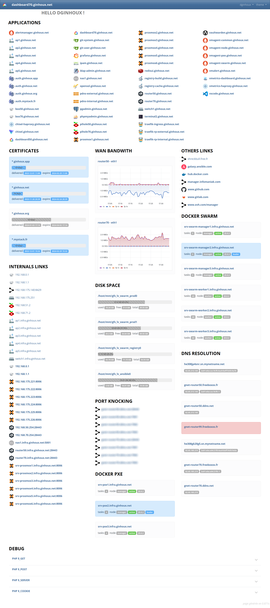

# webapp_dashboard_php


## DESCRIPTION

It's my own PHP web Dashboard. <br />
It use bootstrap, jquery and bootswatch for better UI.
<br >
<br >
May be difficult to out of the box : <br />
* use traefik API to list publisheds app
* use docker API to get my 2 swarms clusters informations
* read tls certs files
<br />
<br />
<br />
A little dirty, all in 3 PHP files : index, config, functions.


## FEATURES

* dynamix apps from traefik reverse proxy
* dns resolver test
* disk usage of specified mount point
* display docker swarm informations
* custom url content
* integrate some grafana embedded panels


## EXAMPLES




## REQUIREMENTS

WebServer like apache, nginx, caddy able to use PHP<br />
PHP v7.x, PHP v8.x<br />

#### INCLUDEDS DEPENDENCIES

* jquery
* bootstrap

Updates must be manually

#### SUBMODULES DEPENDENCIES

* bootswatch : https://github.com/thomaspark/bootswatch


## INSTALLATION

On the root folder of the vhost

#### FROM GIT

```shell
git clone https://github.com/dginhoux/webapp_dashboard_php dashboard
```


## AUTHOR

Dany GINHOUX - https://github.com/dginhoux


## LICENSE

MIT
